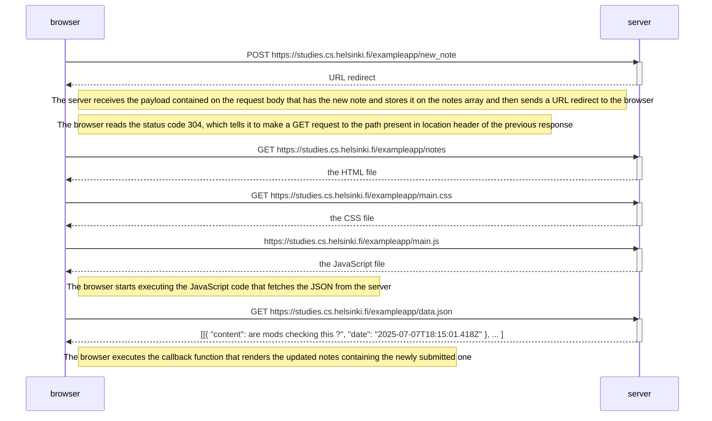

```mermaid
sequenceDiagram
    participant browser
    participant server

    browser->>server: POST https://studies.cs.helsinki.fi/exampleapp/new_note
    activate server
    server-->>browser: URL redirect
    deactivate server

    Note left of server: The server receives the payload contained on the request body that has the new note and stores it on the notes array and then sends a URL redirect to the browser

    Note right of browser: The browser reads the status code 304, which tells it to make a GET request to the path present in location header of the previous response 

    browser->>server: GET https://studies.cs.helsinki.fi/exampleapp/notes
    activate server
    server-->>browser: the HTML file
    deactivate server

    browser->>server: GET https://studies.cs.helsinki.fi/exampleapp/main.css
    activate server
    server-->>browser: the CSS file
    deactivate server

    browser->>server: https://studies.cs.helsinki.fi/exampleapp/main.js
    activate server
    server-->>browser: the JavaScript file
    deactivate server

    Note right of browser: The browser starts executing the JavaScript code that fetches the JSON from the server 

    browser->>server: GET https://studies.cs.helsinki.fi/exampleapp/data.json
    activate server
    server-->>browser: [[{ "content": are mods checking this ?", "date": "2025-07-07T18:15:01.418Z" }, ... ]
    deactivate server

    Note right of browser: The browser executes the callback function that renders the updated notes containing the newly submitted one 
```
