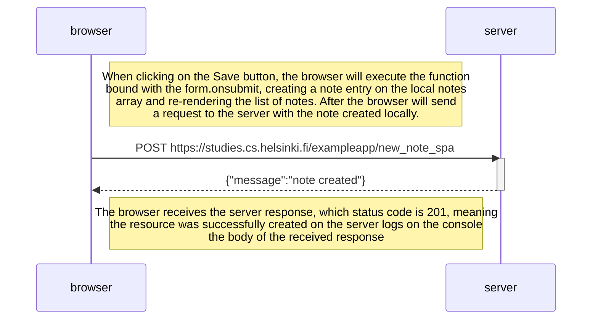

```mermaid
sequenceDiagram
    participant browser
    participant server

    Note right of browser: When clicking on the Save button, the browser will execute the function<br> bound with the form.onsubmit, creating a note entry on the local notes<br> array and re-rendering the list of notes. After the browser will send<br> a request to the server with the note created locally.

    browser->>server: POST https://studies.cs.helsinki.fi/exampleapp/new_note_spa
    activate server
    server-->>browser: {"message":"note created"}
    deactivate server

    Note right of browser: The browser receives the server response, which status code is 201, meaning<br>the resource was successfully created on the server logs on the console<br> the body of the received response
```
